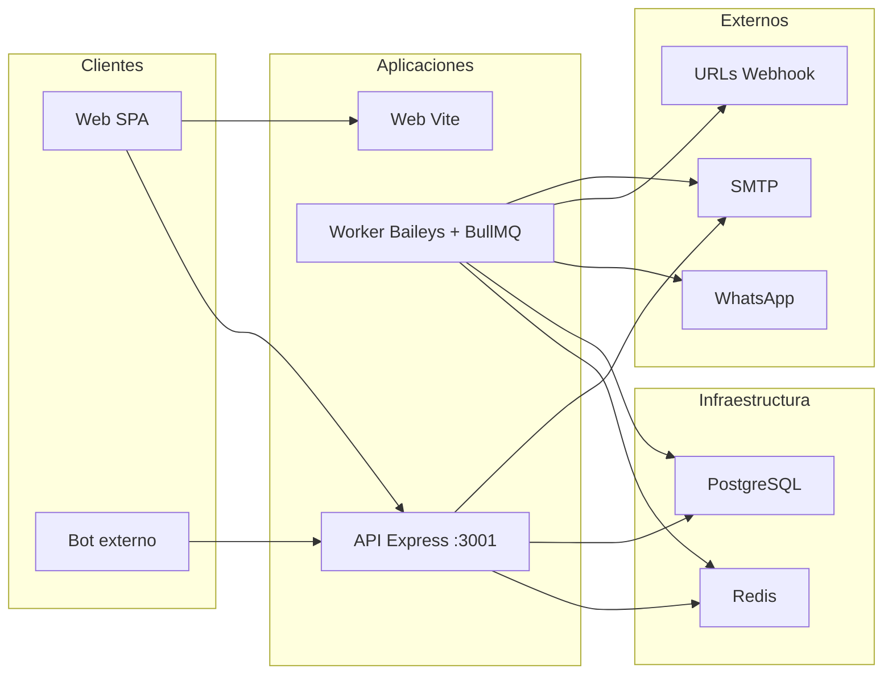

# Arquitectura — WhatsApp Connect v2

Este documento describe los componentes del sistema, su responsabilidad y las variables de entorno críticas.

## Diagrama de componentes

## Responsabilidades por aplicación

| Aplicación | Ruta / Puerto | Responsabilidad |
|------------|----------------|------------------|
| **API** | `apps/api`, puerto 3001 | Autenticación (JWT, x-api-key + x-tenant-id), CRUD de tenants, usuarios, dispositivos, webhooks; creación de OutboundMessage y encolado en Redis; health; endpoint público QR. |
| **Worker** | `apps/worker`, health 3030 | Mantener sesiones WhatsApp (Baileys) por dispositivo; recibir mensajes (messages.upsert), normalizar, crear Event y WebhookDelivery, encolar webhook_dispatch; consumir device_commands (connect/disconnect/reset-sender-sessions); consumir outbound_messages (enviar por Baileys); consumir webhook_dispatch (POST a URLs). |
| **Web** | `apps/web` | SPA React: login, listado de dispositivos, QR, estado en tiempo real (stream), webhooks, envío de prueba. |

## Paquetes compartidos

| Paquete | Ruta | Uso |
|---------|------|-----|
| **db** | `packages/db` | Prisma schema y cliente (PostgreSQL). Modelos: Tenant, User, Device, WaSession, Event, WebhookEndpoint, WebhookDelivery, OutboundMessage, Log, PublicQrLink. |
| **logger** | `packages/logger` | Logs persistentes en BD (tabla Log). Usado por API y Worker. |
| **alert** | `packages/alert` | Envío de alertas por email (nodemailer). Inicio de API/Worker y crashes. |

## Colas Redis (BullMQ)

API y Worker deben usar el **mismo REDIS_URL**.

| Cola | Productor | Consumidor | Contenido del job |
|------|-----------|------------|--------------------|
| **device_commands** | API | Worker | `connect`, `disconnect`, `reset-sender-sessions` con `deviceId` (y `jids` para reset). |
| **outbound_messages** | API (y opcionalmente Worker para ack inbound) | Worker | `send` con `outboundMessageId`. |
| **webhook_dispatch** | Worker (inbound) | Worker | `deliver` con `deliveryId`. |

## Flujo de datos resumido

- **Entrante:** WhatsApp → Worker (Baileys) → Event en DB → WebhookDelivery + job webhook_dispatch → Worker hace POST a la URL del webhook.
- **Saliente:** Cliente → API → OutboundMessage en DB + job outbound_messages → Worker envía por Baileys.
- **Dispositivo:** Cliente → API → job device_commands → Worker ejecuta connect/disconnect/reset-sender-sessions.

## Variables de entorno críticas

| Variable | Dónde | Descripción |
|----------|--------|-------------|
| **DATABASE_URL** | API, Worker | URL PostgreSQL. |
| **REDIS_URL** | API, Worker | Misma URL para que las colas sean compartidas. |
| **JWT_SECRET** | API | Firma de tokens de sesión. |
| **BOT_API_KEY** | API | Clave para autenticación de bots (x-api-key). |
| **WA_AUTH_ENC_KEY_B64** | Worker | Clave AES-256 (32 bytes en base64) para cifrar estado de sesión en BD. Debe ser idéntica en todos los procesos que accedan a WaSession. |
| **WORKER_RECONNECT_ALL_DELAY_MS** | Worker | Delay antes de reconectar dispositivos al arrancar (default 5000). |
| **WORKER_RECONNECT_STAGGER_MS** | Worker | Milisegundos entre cada reconexión (default 5000). |
| **WORKER_INBOUND_ACK_MESSAGE** | Worker | Opcional: mensaje automático al recibir cada inbound (evita "Esperando el mensaje"). |
| **WORKER_COMPOSING_BEFORE_SEND_MS** | Worker | Milisegundos "escribiendo..." antes de enviar (default 1500). |
| **FRONTEND_URL** | API | Base URL del frontend (links públicos QR). |
| **ENV_FILE** | API, Worker | Ruta al archivo de env (ej. `env.local`). |

Ver también: [README raíz](../README.md), [FLUJOS.md](FLUJOS.md), [DIAGNOSTICO.md](DIAGNOSTICO.md).
