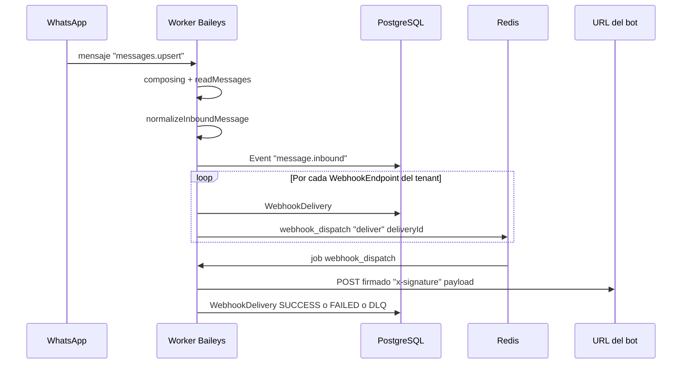
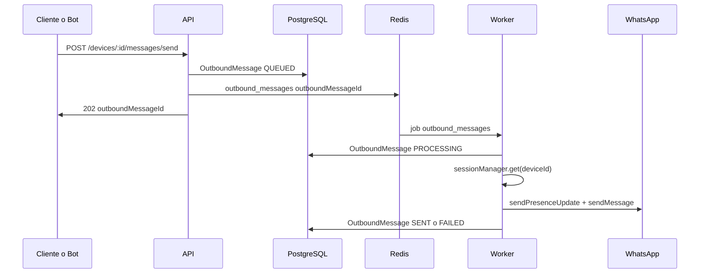

# Flujos paso a paso

Referencia de los flujos principales del sistema con archivos y números de paso para depuración.

---

## 1. Mensaje entrante (WhatsApp → tu sistema)

### Pasos y archivos

| Paso | Archivo / lógica | Qué hace | Si falla |
|------|------------------|----------|----------|
| 1 | `apps/worker/src/wa/sessionManager.ts` — listener `messages.upsert` | Recibe el mensaje de Baileys y llama a `handleMessagesUpsert` | Sesión desconectada; Device.status ERROR; lastError en BD; logs "SessionError", "decrypt" |
| 2 | `apps/worker/src/wa/inbound.ts` — `handleMessagesUpsert` | Filtra fromMe/status; envía composing; readMessages; normaliza | "Esperando el mensaje": retraso; ver processingTimeMs en logs; stub/decryption → clearSenderAndReconnect |
| 3 | `apps/worker/src/wa/normalize.ts` — `normalizeInboundMessage` | Convierte proto a `normalized` (from, content.text, etc.) | Texto vacío: log `[inbound-inspect]` rawMessageKeys; tipos no soportados |
| 4 | `apps/worker/src/wa/inbound.ts` | `prisma.event.create`; por cada endpoint `webhookDelivery.create` + `webhookQueue.add('deliver', { deliveryId })` | Event no creado: excepción en worker; delivery no encolada: Redis caído o worker sin Redis |
| 5 | `apps/worker/src/queues/webhookDispatch.ts` | Job: fetch al endpoint con headers y firma; actualiza WebhookDelivery SUCCESS/FAILED/DLQ | 4xx/5xx o timeout: WebhookDelivery.lastError, nextRetryAt; DLQ = sin más reintentos; log "Webhook delivery failed" |

**Logs útiles:** `[paso-1]` … `[paso-6]` en consola del worker; tabla `Log` (service=worker); tabla `WebhookDelivery` (status, lastError, attempts).

---

## 2. Mensaje saliente (tu sistema → WhatsApp)

### Pasos y archivos

| Paso | Archivo | Qué hace | Si falla |
|------|---------|----------|----------|
| 1 | `apps/api/src/index.ts` — POST `/devices/:id/messages/send` | Valida device, tenant, status=ONLINE; crea OutboundMessage; encola job | 409 device_not_online: Device.status; 403/404: tenant o device |
| 2 | `apps/worker/src/queues/outboundMessages.ts` | Busca OutboundMessage; actualiza PROCESSING; busca Device y socket en SessionManager | Mensaje no encontrado: id erróneo; device_not_online / device_not_connected: Device o socket |
| 3 | Mismo worker | `sock.sendMessage(to, { text })` | FAILED: OutboundMessage.error; log "[paso-9] FALLO envío por socket"; reintentos BullMQ |

**Logs útiles:** `[paso-7]` (API encolado), `[paso-8]` / `[paso-9]` (worker); tabla `OutboundMessage` (status, error).

---

## 3. Ciclo de vida del dispositivo (conectar / desconectar)

| Acción | Quién | Cola | Worker / lógica |
|--------|--------|------|------------------|
| Conectar | API `POST /devices/:id/connect` | `device_commands` job `connect` | `apps/worker/src/queues/deviceCommands.ts` → `sessionManager.connect(deviceId)` |
| Desconectar | API `POST /devices/:id/disconnect` o DELETE device | `device_commands` job `disconnect` | `sessionManager.disconnect(deviceId)` |
| Reset sesión | API `POST /devices/:id/reset-session` | — (no cola) | Borra WaSession y pone device OFFLINE en API |
| Reset sender sessions | API `POST /devices/:id/reset-sender-sessions` | `device_commands` job `reset-sender-sessions` | `apps/worker/src/wa/authStateDb.ts` — `clearSessionsForJids(deviceId, jids)` |

**Al arrancar el worker:** tras un delay, `deviceCommands.ts` ejecuta `reconnectAllInitializedDevices`: reconecta todos los dispositivos que tienen `WaSession` en BD.

**Si connect falla:** `sessionManager.ts` actualiza Device (status ERROR, lastError); revisar logs del worker; `WA_AUTH_ENC_KEY_B64` y conectividad Redis/DB.

---

## Enlaces

- [ARQUITECTURA.md](ARQUITECTURA.md) — Componentes y variables de entorno.
- [DIAGNOSTICO.md](DIAGNOSTICO.md) — Síntomas y dónde revisar.
